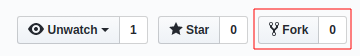
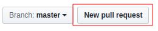
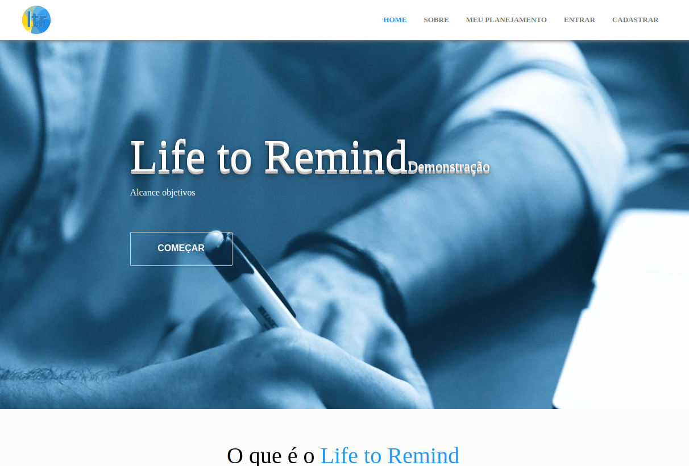
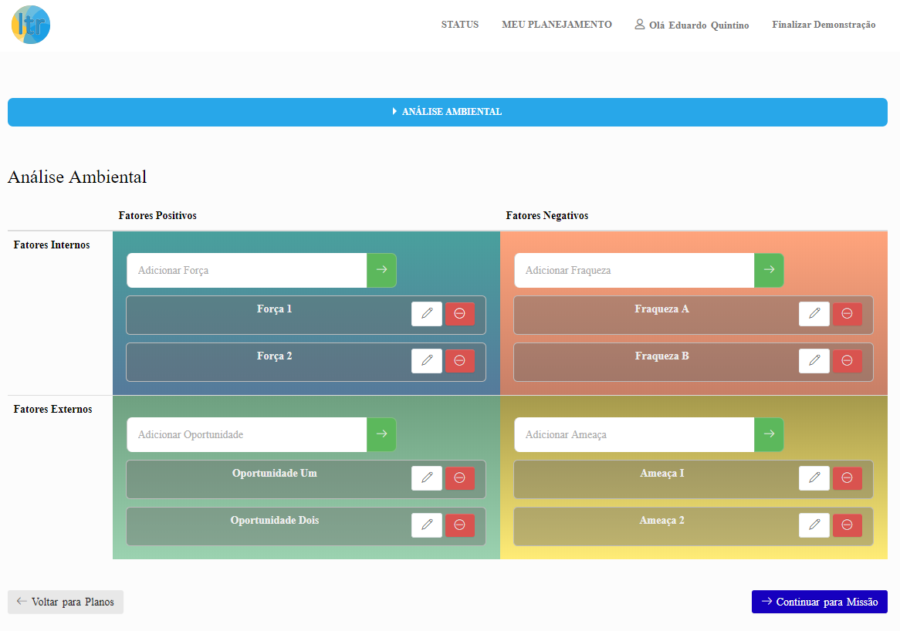
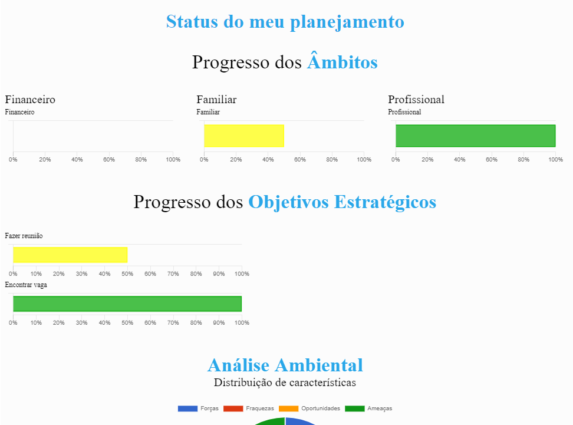
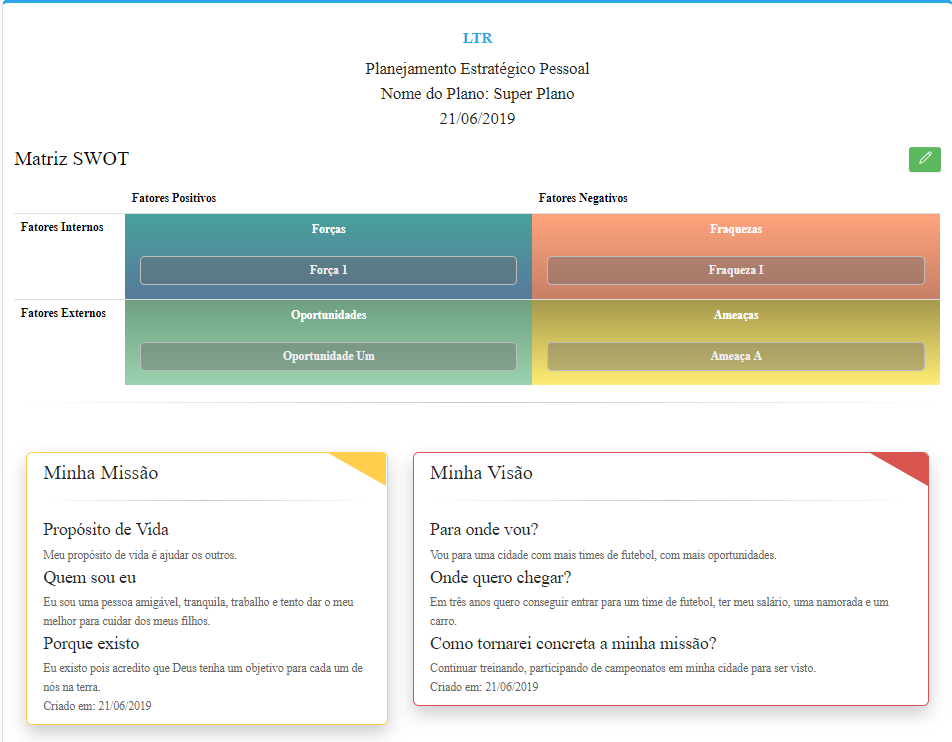

# LifeToRemind

O LifeToRemind é um site para criação de Planejamentos Estratégicos Pessoais voltado para a carreiras.

Este repositório contém a demonstração do site feita para a disciplina de Trabalho de Conclusão de Curso 2 da Universidade de Brasília campus Gama (UnB - FGA).

## Ferramentas e Ambiente

* Ubuntu 16.04.5 LTS 64-bit
* RVM 1.29.8
* Ruby 2.5.5p157
* Rails 5.2.3
* PostgreSQL 9.5.17

## Instalação e Execução

Em um terminal, clone o repositório.

```console
git clone https://github.com/eduqg/ltr
```

Abra a pasta do projeto.
```console
cd ltr
```

[Instale o Ruby Version Manager (RVM)](https://github.com/rvm/ubuntu_rvm) para a configuração da aplicação.

Execute os comandos para configurar a versão correta para o projeto.

```console
rvm install 2.5.5
gem install rails -v 5.2.3
bundle install
```

[Instale o Postgres](https://www.digitalocean.com/community/tutorials/how-to-setup-ruby-on-rails-with-postgres) para o banco de dados da aplicação.

Faça as migrações necessárias.

```console
rake db:create
rake db:migrate
```

Execute o projeto.

```console
rails s
```

Abra o navegador em [localhost:3000](http://localhost:3000)

Para executar os testes da aplicação.
```console
rspec
```

## Seja um desenvolvedor do Life to Remind

Passo 1 - Faça um cópia do repositório clicando na aba Fork.



Passo 2 - Faça download do projeto Life to Remind criado na sua conta.
```console
git clone https://github.com/SEU_USUARIO/lifetoremind.git
```

Passo 3 - Troque para uma nova branch.
```console
git checkout -b test
```

Passo 4 - Realize as alterações no código e envie para o seu repositório. Os commits deverão ser em inglês.

```console
git add new_file.txt
```
```console
git commit -m"Adding new file"
```
```console
git push origin test
```

Passo 5 - Entre no seu repositório com as mudanças realizadas e clique para fazer o Pull Request para a branch test.



Passo 6 - Aguarde seu Pull Request ser aprovado e parabéns por se tornar um desenvolvedor do Life to Remind!

## Imagens da Aplicação

<table>
  <tr class="row">
    <th class="column"">
      
    </th>
    <th class="column">
      
    </th>
  </tr>

  <tr class="row">
    <th class="column">
      
    </th>
    <th class="column">
      
    </th>
  </tr>
</table>

